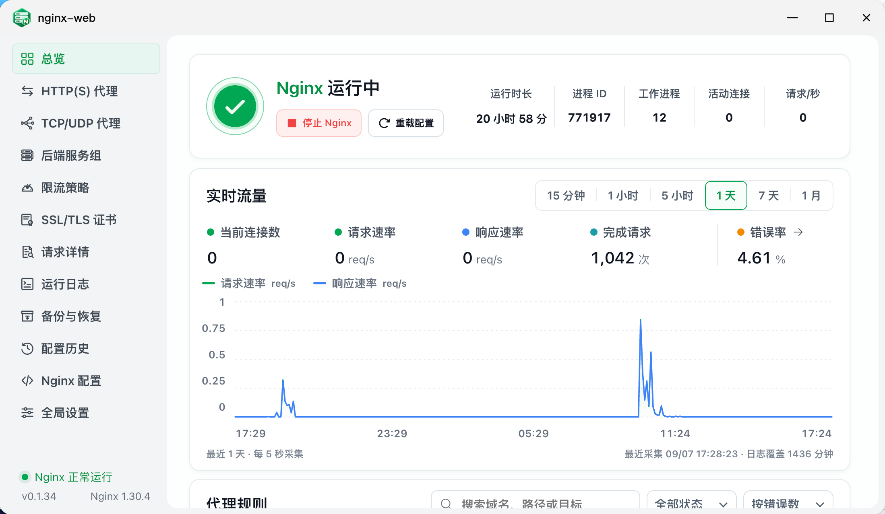

<div align="center">


# nginx-web for fnOS

**运行在飞牛 fnOS 上的原生 Nginx 反向代理管理器**

通过 fnOS 桌面管理 HTTP/HTTPS 代理、TCP/UDP 转发、SSL 证书、后端服务组与访问统计。

[](https://github.com/chenpingonline/nginx-web-fnos/releases)
[](https://github.com/chenpingonline/nginx-web-fnos/releases)

[](https://nginx.org/)
[](LICENSE)

[下载 Releases](https://github.com/chenpingonline/nginx-web-fnos/releases/latest) · [使用指南](docs/user-guide.md) · [问题反馈](https://github.com/chenpingonline/nginx-web-fnos/issues) · [NGINX](https://nginx.org/)

</div>

<p align="center">
  
</p>

---

## 项目简介

nginx-web 是为 **飞牛 fnOS** 设计的反向代理管理应用，通过结构化表单配置访问入口，将 NAS 应用、容器服务和局域网设备接入统一的域名与端口。

- **原生应用**：从 fnOS 桌面打开，管理界面通过统一网关访问，自动跟随平台亮暗主题。
- **独立运行**：FPK 内置 Nginx Open Source 1.30.4，使用自己的进程、配置和日志目录。
- **可视化配置**：管理代理、证书、负载均衡和访问控制，应用前自动校验，失败时尝试回滚。

> [!NOTE]
> 安装和运行无需 Docker，也无需额外安装 Go 或 Node.js。应用不读取、修改或重启飞牛系统 Nginx。仓库名为 `nginx-web-fnos`，fnOS 内的应用名称与安装标识为 `nginx-web`。

---

## 功能

| 模块 | 功能 |
| --- | --- |
| 总览 | 查看 Nginx 运行状态、HTTP 请求趋势、连接数、错误率及规则生效状态 |
| 代理 HTTP(S) | 管理域名与路径转发、WebSocket、SSE、HTTP/2、静态文件和跳转 |
| 规则分组 | 共享监听类型、协议、监听端口、证书与 HTTP/2 默认值，支持逐项取消继承 |
| TCP/UDP 代理 | 四层转发、TLS 终止、SNI 分流、PROXY Protocol 与访问控制 |
| 后端服务组 | 管理多个节点、权重、备用节点及负载均衡策略，可供多个规则复用 |
| 限流策略 | 管理请求速率、突发请求、并发连接与下载速度限制 |
| SSL/TLS 证书 | 导入 PEM 证书，通过 ACME DNS-01 自动签发与续期，接入 39 个 DNS 服务商适配器 |
| 请求详情 | 按时段与规则查看 HTTP 请求、4xx/5xx 错误趋势和统计覆盖情况 |
| 运行日志 | 查看 HTTP、Stream、Nginx 错误及管理服务日志 |
| 备份与恢复 | 导出 JSON 备份，恢复代理、分组、证书和设置为草稿 |
| 配置历史 | 保存配置快照、查看历史并恢复为草稿 |
| Nginx 配置 | 只读查看生成配置，执行校验并应用草稿 |
| 全局设置 | 管理默认端口、Worker、TLS、Gzip、Real IP、日志轮转和缓存等参数 |

首次配置与排查请看 [使用指南](docs/user-guide.md)，详细配置项见 [功能与使用说明](docs/features.md)，DNS 凭据配置见 [DNS 服务商说明](docs/dns-providers.md)。

---

## Nginx 工作方式

### 独立 Nginx

安装包同时包含 Go 管理服务、编译后的管理页面和对应架构的 Nginx。管理服务通过 fnOS 统一网关提供界面与 API，Nginx 负责处理实际代理流量。

```text
管理入口：fnOS 桌面 → 统一网关 → Unix Socket → Go 管理服务
代理流量：客户端 → 应用内置 Nginx → NAS / 容器 / 局域网服务
```

### 配置应用

1. 通过表单创建或修改配置。
2. 应用时生成候选配置，并执行 `nginx -t` 校验。
3. 校验通过后替换正式配置；Nginx 运行时执行平滑重载。
4. 启动或重载失败时，尝试恢复上一份有效配置。

恢复备份或历史快照会生成草稿，检查后再应用。界面上的“保存并应用”会应用全部待生效修改。

> [!IMPORTANT]
> 应用以普通用户运行，监听端口范围为 **1024–65535**。如需使用外部 80/443，可在路由器将其映射到应用的高位端口。请选用未被其他服务占用的端口。

---

## 支持平台

| fnOS 设备架构 | Release 文件 | 内置 Nginx |
| --- | --- | --- |
| Intel / AMD x86_64 | `nginx-web-<version>-x86_64.fpk` | Linux AMD64 静态二进制 |
| ARM64 / aarch64 | `nginx-web-<version>-arm64.fpk` | Linux ARM64 静态二进制 |

运行要求：

- **fnOS 1.1.3100 或更新版本**。
- 使用 fnOS 管理员账号安装和访问管理界面。
- NAS 能够连接待代理的目标服务。

文件名中的 `x86_64` 表示 Intel / AMD 64 位，`arm64` 表示 ARM 64 位。当前不提供 32 位或 `all` 通用安装包。

> [!TIP]
> 平台自动主题需要 fnOS 1.2.0401 / App 1.34.0 及以上；旧系统或独立浏览器会跟随浏览器主题。

---

## 安装

### 从 GitHub Releases 安装

1. 打开项目的 [Releases](https://github.com/chenpingonline/nginx-web-fnos/releases/latest)。
2. 根据 NAS CPU 架构下载对应的 `.fpk`。
3. 进入 **fnOS → 应用中心 → 手动安装**。
4. 选择下载好的 FPK 并完成安装。
5. 从 fnOS 桌面打开 **nginx-web**。

升级时可通过手动安装选择新版 FPK，建议先在“备份与恢复”中导出配置。各版本的更新内容和验证范围以 Release 说明为准。

### SHA-256 校验

Release 提供以下文件：

```text
nginx-web-<version>-x86_64.fpk
nginx-web-<version>-arm64.fpk
SHA256SUMS.txt
```

将校验文件与下载的 FPK 放在同一目录。下载两个安装包后，在 Linux 上执行：

```bash
sha256sum -c SHA256SUMS.txt
```

只下载一个架构时，可以先筛选对应记录，例如 x86：

```bash
grep 'x86_64\.fpk$' SHA256SUMS.txt | sha256sum -c -
```

macOS 可将上述命令中的 `sha256sum` 替换为 `shasum -a 256`。

---

## 快速上手

完整步骤见 [使用指南](docs/user-guide.md)，包含 IPv6、证书申请与重新签发、分组继承、TCP/UDP 转发及常见错误排查。

以把 `nas.example.com:9080` 转发到局域网服务 `192.168.1.10:3000` 为例：

1. 确保 NAS 能访问目标服务，并将域名解析到可访问的 NAS 地址。
2. 打开 **代理 HTTP(S)**，添加规则：协议选 HTTP，域名填 `nas.example.com`，监听端口填 `9080`，监听类型按实际网络选择 IPv4、IPv6 或双栈。
3. 后端协议选 HTTP，主机填 `192.168.1.10`，端口填 `3000`；按需开启 WebSocket 或流式传输。
4. 保存并应用配置，在总览确认规则已生效、Nginx 正在运行，然后访问 `http://nas.example.com:9080`。

需要 HTTPS 时，先在 **SSL/TLS 证书** 导入证书，或通过 ACME 申请，再为规则选择 HTTPS、证书及空闲监听端口（例如 `9443`）。通配符证书和 DNS 凭据填写方式见 [DNS 服务商说明](docs/dns-providers.md)。


---

## 配置与数据

升级前可在 **备份与恢复** 下载 JSON 备份，再通过 fnOS 安装新版本 FPK。备份包含证书私钥，应妥善保管；**不包含 ACME 账户、DNS 凭据或自动续期任务**，迁移到新设备时需重新配置续期，外部引用文件也需单独迁移。

从旧版本升级后，如首页提示统计入口未启用，需要检查并应用一次当前草稿，才能开始采集新的统计数据。

---

## 项目结构

本项目采用 **单仓库、双架构构建**。前端、Go 服务与 fnOS 生命周期脚本共用，只在打包时选择目标架构的二进制。

```text
nginx-web-fnos/
├── cmd/nginx-web/        # Go 管理服务入口
├── internal/             # 配置模型、API、证书、统计和 Nginx 管理
├── web/                  # Vue 3 + TypeScript 管理页面
├── packaging/fnos/       # manifest、图标、权限与生命周期脚本
├── third_party/nginx/    # 分架构 Nginx、源码来源与许可证资料
├── scripts/              # 构建、版本读取与包校验
├── tests/                # 集成与 FPK 生命周期测试
├── docs/                 # 功能、DNS 服务商与构建说明
└── dist/                 # 本地生成的 FPK 和校验文件，不提交
```

---

## 从源码构建

### 构建环境

- Go 1.26+。
- Node.js 20.19+ 或 22.12+、npm。
- Bash、Python 3、tar 和 `file` 等基础工具。
- 对应架构的 Nginx 静态二进制；编译 Nginx 时使用 Docker 隔离依赖。

### 获取源码与开发检查

```bash
git clone https://github.com/chenpingonline/nginx-web-fnos.git
cd nginx-web-fnos
make frontend-install
make test
```

`make test` 会先执行前端类型检查与生产构建，再运行 Go 测试。前端产物嵌入管理程序，无需在 fnOS 上运行 Vite 开发服务器。

### 准备 Nginx 与构建 FPK

先按 [源码构建文档](docs/build.md) 编译官方 Nginx，并放入对应目录：

```text
third_party/nginx/x86_64/nginx
third_party/nginx/arm64/nginx
```

然后执行：

```bash
make build-x86       # 生成 x86_64 安装包
make build-arm64     # 生成 ARM64 安装包
make build-all       # 依次构建两个架构
```

安装包输出到 `dist/`。构建会检查管理程序及 Nginx 的架构、内置版本、包结构和校验和。

### 统一版本号

应用版本只修改 [`packaging/fnos/manifest`](packaging/fnos/manifest) 的 `version` 字段。前端、Go 服务、FPK 文件名及发布脚本均读取此文件，修改后需重新构建。

`make release` 在 Linux 上构建两个架构并执行本机架构的集成与生命周期测试，生成安装包和 `SHA256SUMS.txt`；不会自动创建 GitHub Release。

---

## 常见问题

### 会影响飞牛自带的 Nginx 吗？

应用只使用自己的安装、配置、数据和临时目录，不操作系统 Nginx。仍需选择未被其他服务占用的监听端口。

### 需要 Docker 吗？

安装和运行 FPK 不需要。只有从官方源码编译内置 Nginx 时，构建脚本使用 Docker 隔离编译依赖。

### 可以直接编辑 nginx.conf 吗？

当前提供生成配置的只读预览，配置修改通过表单完成，不开放任意原始指令编辑。

### 为什么没有流量数据？

统计从开始采集后积累；缺失历史保留为空。关闭访问日志会停止规则日志统计。WebSocket、SSE 和长下载在请求结束后才计入完成请求数。TCP/UDP 会话不计入 HTTP 指标。

### 支持哪些证书验证方式？

ACME 当前支持 DNS-01，尚不支持 HTTP-01、IP 地址签发或飞牛系统证书同步。已接入适配器不代表每个 DNS 服务商都经过真实账号验证。

### 为什么首次打开代理端口返回 404？

没有配置规则时，应用的默认 `9080` 端口返回 404。添加匹配域名与端口的代理规则并应用后，再使用该域名访问。

---

## 当前限制

内置 Nginx 未包含 HTTP/3/QUIC、Brotli、Lua/OpenResty、JWT、headers-more、GeoIP2、ModSecurity/WAF、第三方主动健康检查或 Prometheus 模块。Basic Auth 密码文件和客户端 CA 等外部文件需自行维护，并确保应用用户可读。

每个 Release 的测试范围以发布说明为准；构建与包校验不能替代实体 fnOS 设备的安装、升级及使用验证。

---

## 开发与贡献

欢迎通过 [Issue](https://github.com/chenpingonline/nginx-web-fnos/issues) 反馈问题，或提交 Pull Request。

问题反馈请尽量包含：

- 应用版本、fnOS 版本和 CPU 架构。
- 可复现的操作步骤、预期结果与实际结果。
- 脱敏后的日志或截图。

请勿上传私钥、DNS Token 或完整配置备份。代码修改请附上相关测试结果，真实 Nginx 及生命周期测试方法见 [测试说明](tests/README.md)。

---

## 致谢

感谢以下开源项目：

- [NGINX](https://nginx.org/)：HTTP 与 Stream 代理核心。
- [lego](https://github.com/go-acme/lego)：ACME 证书签发与 DNS 服务商适配器。
- [Vue](https://github.com/vuejs/core) 与 [Vite](https://github.com/vitejs/vite)：管理界面与前端构建。
- [Phosphor Icons](https://github.com/phosphor-icons/vue)：界面图标。

---

## License

项目源码采用 [GNU GPL v3](LICENSE)。

内置 Nginx 及相关组件遵循各自的许可证，来源和许可证说明见 [NGINX_LICENSE](NGINX_LICENSE)、[NOTICE](NOTICE) 与 [THIRD_PARTY_LICENSES.md](THIRD_PARTY_LICENSES.md)。
